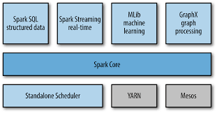
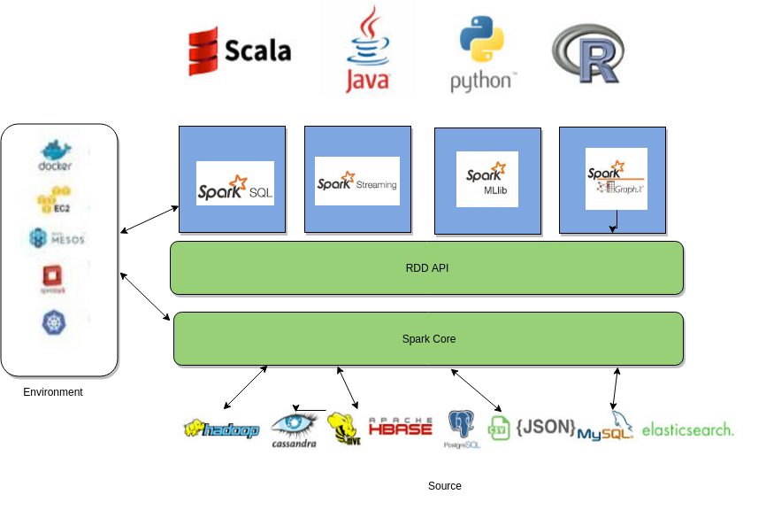
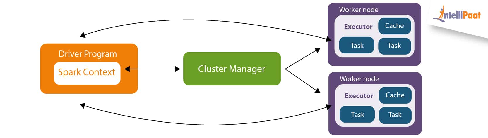

# Learning By Doing : Spark

Welcome to the Learning Spark repository! 
This repository is designed to help you learn Apache Spark through a hands-on approach. These modules cover the fundamentals concepts of Spark, enabling you to harness the power of distributed computing for big data processing.

## Repository Modules

- [Spark Core Repository](https://github.com/elmehdi-elkari/Big_Data/tree/main/spark/spark-core-rdd)
- [Spark SQL Repository](https://github.com/elmehdi-elkari/Big_Data/tree/main/spark/spark-sql)
- [Spark Streaming Repository]([link_to_spark_streaming](https://github.com/elmehdi-elkari/Big_Data/tree/main/spark/spark-Streaming-))
- [Spark MLlib Repository](https://github.com/elmehdi-elkari/Big_Data/tree/main/spark/spark-MLib)

## General Overview

Apache Spark is an open-source, distributed computing system that provides fast and general-purpose data processing for large datasets. This repository is structured into four main modules, each focusing on a specific aspect of Spark:

1. **Spark Core**: Explore the foundational concepts of Spark, including Resilient Distributed Datasets (RDDs) and their operations and transformations. [Learn More](link_to_spark_core)

2. **Spark SQL**: Learn about Datasets and DataFrames, and discover the benefits of using SQL syntax for Spark data manipulation. [Learn More](link_to_spark_sql)

3. **Spark Streaming**: Dive into real-time data processing using Spark Streaming, allowing you to handle and analyze data in motion. [Learn More](link_to_spark_streaming)

4. **Spark MLlib**: Understand the distributed machine learning capabilities of Spark through MLlib, enabling you to build scalable and efficient machine learning models. [Learn More](link_to_spark_mllib)

## What is Apache Spark?

Apache Spark is a fast and general-purpose cluster-computing framework for big data processing. It provides high-level APIs in Java, Scala, Python, and R, making it accessible to a wide audience. Spark is known for its in-memory processing capabilities, fault tolerance, and ease of use.

### Spark ecosystem

### Spark architecture

A typical Spark application comprises the following key elements:
- Driver Program: The main program that defines the high-level control flow of the application. It contains the SparkContext, which is the entry point for interacting with the Spark cluster. The driver program is responsible for creating RDDs, defining transformations and actions, and coordinating the execution.
- SparkContext: The entry point for any Spark functionality. It manages the communication with the Spark cluster and coordinates the execution of tasks. The SparkContext sets up the application and establishes the connection with the cluster manager.
- Cluster Manager: The component responsible for managing and allocating resources across the Spark cluster. Common cluster managers include Apache Mesos, Apache Hadoop YARN, and Spark's standalone cluster manager.
- Executor: Worker nodes that run tasks as part of the Spark application. Executors are responsible for executing computations and storing data for RDD partitions. They communicate with the driver program and the cluster manager to receive tasks and report the results.
- Task: The smallest unit of work in a Spark application. Tasks are executed on individual partitions of RDDs in parallel across the cluster. Each executor runs multiple tasks concurrently.
- Resilient Distributed Datasets (RDDs): The fundamental data structure in Spark, representing distributed collections of objects. RDDs are immutable, fault-tolerant, and partitioned across the cluster. Transformations and actions are applied to RDDs to perform computations.
- Stages and Tasks Execution: Spark applications are divided into stages, each comprising a set of transformations on data and the corresponding set of tasks. Stages are executed in a pipeline fashion, with tasks running in parallel on different executors.
- Dependencies: RDDs maintain lineage information, capturing the sequence of transformations applied to derive the current state. This lineage information is used for fault recovery and recomputation in case of node failures.
